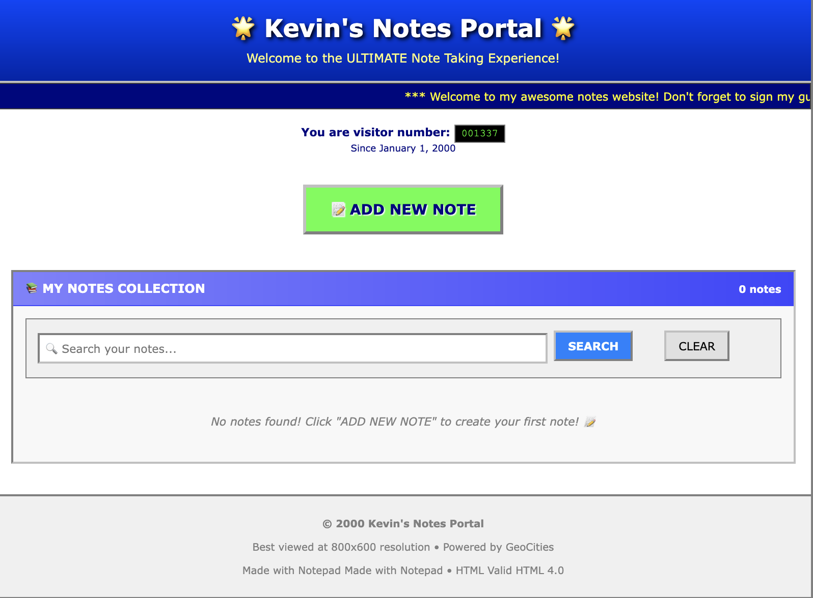

# Zero-Framework Notes App

> **Built from absolute scratch** - Pure Python, vanilla JavaScript, and HTML/CSS. No Express, No React, No Flask, No databases.



## What Makes This Special

- **100% Framework-Free Backend**: Raw Python sockets, manual HTTP parsing, custom routing
- **Pure Vanilla Frontend**: Zero JavaScript frameworks - just DOM manipulation and fetch API
- **Custom Database**: JSON-based ORM built from scratch with auto-persistence
- **Manual HTTP Protocol**: Hand-crafted request/response handling
- **Async Non-blocking Server**: Built with Python `select` for concurrent connections

## Learning Journey

This project was my deep dive into **low-level web fundamentals**:
- Understanding HTTP protocol from ground up
- Socket programming and network communication
- Building database abstractions without ORMs

**Next Goal**: Building a mini web framework from these learnings

## Quick Start

```bash
# Clone and run - that's it!
git clone https://github.com/kevinnadar22/HTTP-Server
cd HTTP-Server
python main.py
```

Open http://localhost:8000 - Your notes app is ready! ✓


## ✓ Features
- Full CRUD (Create, Read, Update, Delete)
- Real-time search and responsive design
- Auto-saving database and modern UI
- Concurrent connections and error handling
- HTTP compliance and RESTful API

## UI Demo


## 🛠 Technical Stack

| Layer | Technology | Why No Framework? |
|-------|------------|-------------------|
| **Server** | Raw Python Sockets | Learn HTTP fundamentals |
| **Database** | Custom JSON ORM | Understand data persistence |
| **Frontend** | Vanilla JS + CSS | Master DOM manipulation |
| **Styling** | Pure CSS | Learn responsive design |
| **API** | Hand-built REST | Understand HTTP methods |

---

## Contact

[kevinnadar22](https://github.com/kevinnadar22)

[Email](mailto:jesikamaraj@gmail.com)
